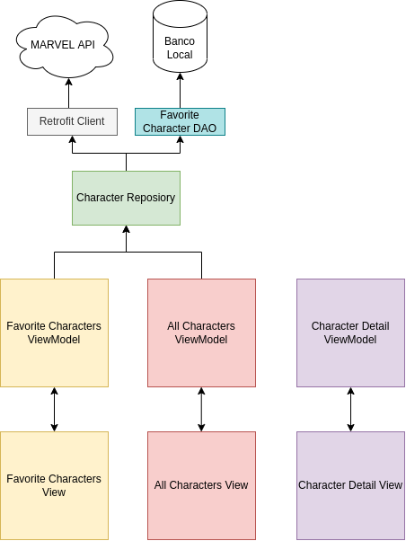
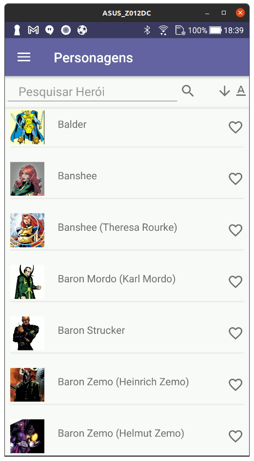
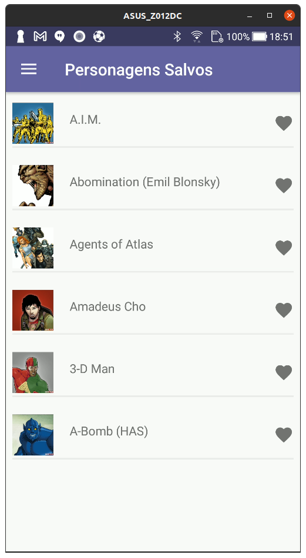
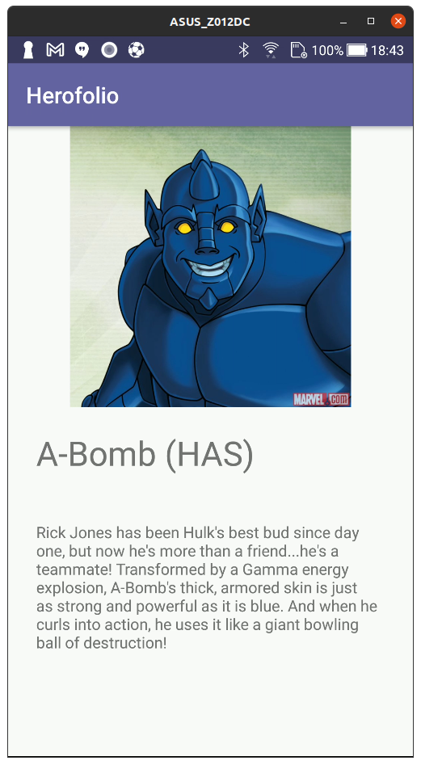

# Herofolio

## Objetivo

Este aplicativo utiliza a [API da Marvel](https://developer.marvel.com/) para realizar a listagem dos personagens, onde você pode salvar os personagens e obter informações sobre eles.

### Recursos
* Busca por nome de personagem
* Salvar personagens favoritos
* Detalhes do personagem
* Listagem por ordem alfabética crescente e decrescente

## Como Utilizar

Primeiramente, você precisa criar uma conta no site da Marvel e obter uma chave pública e uma chave privada. Com estas duas chaves obtidas, dentro do diretório `/app/src/main/java/com/hiller/herofolio/service/constants/` há um arquivo `AppConstantsExample.kt`, substitua as constantes `apikey` e `privateKey` com os valores da sua conta.  

Por último, renomeie o arquivo para `AppConstants.kt`.

### Estrutura do Projeto

 

    

 

Foi utilizada a arquitetura MVVM para estrutaração das classes e das responsabilidade de cada componente.

#### View
Na camada View foram implementadas 3 telas, onde uma é reponsável pela listagem dos personagens da API, outra para mostrar os personagens salvos e, por último, uma para mostrar o detalhe do personagem.

#### ViewModel
Para a camada ViewModel, foram implementadas as funções de filtro, listagem e chamada de funções fornecidas pela camada Repository.

#### Repository
Nesta camada está a implementação da comunicação entre o servidor da Marvel para obter a lista de personagens e informações de cada personagem individualmente e, também, salvar, editar e remover os personagens salvos no banco local.

#### Screenshots

* Tela inicial:

    

* Personagens favoritos

    

* Detalhe do personagem

    

## Licença

MIT © Rafael Hiller

## Autor

Feito por Rafael Hiller.

 